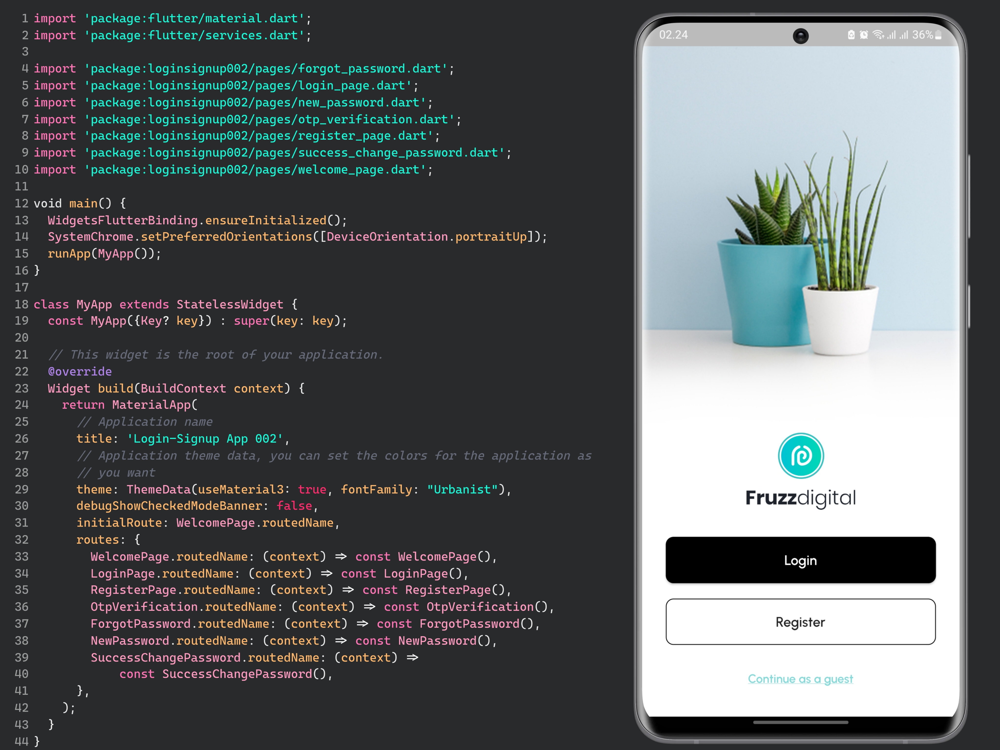

# Login-Signup App 002

This app is made using Flutter, a cross-platform framework for mobile app development.

## Description

Flutter is a modern, open-source framework for building high-performance, high-fidelity, app experiences for iOS and Android from a single codebase. It was developed by Google and uses the Dart programming language. Flutter is known for its fast development cycle, expressive and flexible UI, and native performance. The framework includes a rich set of customizable widgets, tools, and libraries that make it easy to build beautiful and functional apps. It also has a growing community of developers and designers who are constantly contributing to the ecosystem. Whether you're building a simple MVP or a complex, data-driven app, Flutter has everything you need to create an outstanding user experience.

## Design by figma.com/@fruzzdigital

## Screenshot

## Getting Started

This project is a starting point for a Flutter application.

A few resources to get you started if this is your first Flutter project:

- https://flutter.dev/docs/get-started/codelab
- https://flutter.dev/docs/cookbook

For help getting started with Flutter, view our
https://flutter.dev/docs, which offers tutorials,
samples, guidance on mobile development, and a full API reference.
